# Image Mosaics

## 1 - Getting Correspondences

#### Use SIFT descriptor
 
The scale-invariant feature transform (SIFT) is a computer vision algorithm to detect, describe, and match local features in images, invented by David Lowe in 1999. Applications include object recognition, robotic mapping and navigation, image stitching, 3D modeling, gesture recognition, video tracking, individual identification of wildlife and match moving.
 
 

#### <begin> Steps

- Scale-space peak selection: Potential location for finding features.
 
Difference of Gaussians (DoG) approximate Laplacian of Gaussian (LoG) which is a well known blob detector (LoG filters give high response to regions corresponding to blobs). You need to apply the filters in the scale space due to not knowing the exact scale of each blob in the image. In this way, you get responses for blobs in different scales.

 
  
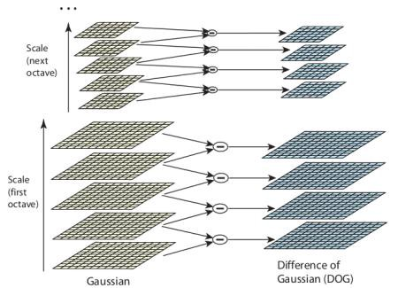

---------

- Keypoint Localization: Accurately locating the feature keypoints.
 
After scale space extrema are detected (their location being shown in the uppermost image) the SIFT algorithm discards low-contrast keypoints (remaining points are shown in the middle image) and then filters out those located on edges. Resulting set of keypoints is shown on last image.

 

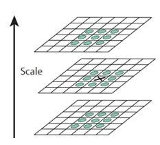

---------

- Orientation Assignment: Assigning orientation to keypoints.
 
An orientation histogram is formed from the gradient orientations of sample points within a region around the keypoint. The orientation histogram has 36 bins covering the 360 degree range of orientations.

 

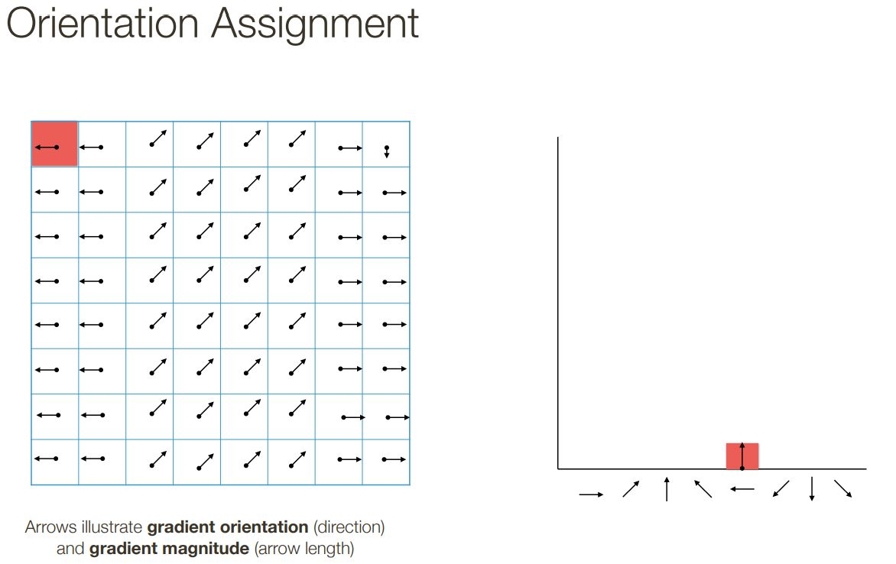

---------

  

- Keypoint descriptor: Describing the keypoints as a high dimensional vector.
 
A SIFT descriptor of a local region (keypoint) is a 3-D spatial histogram of the image gradients. The gradient at each pixel is regarded as a sample of a three-dimensional elementary feature vector, formed by the pixel location and the gradient orientation.
  
 

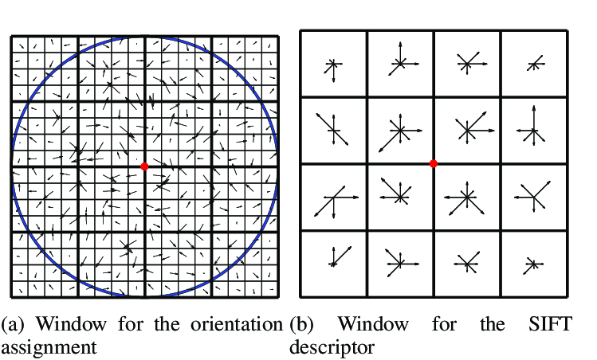

--------   

- Keypoint Matching

 
  

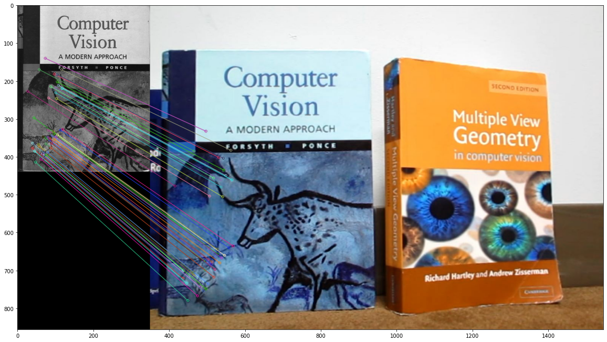

------- 

### Matching Paramter

- 2 KNN Matching

- Applied ratio 0.75

- 50 correspondences

  

## 2 - Homography Parameters

### 2D transformations in heterogeneous coordinates

#### Determining the homography matrix

##### $P^{`}$ = $H$ . $P$

 

$$ \begin{bmatrix}
x_{n}\\
y_{n}\\
1
\end{bmatrix}
= \alpha
\begin{bmatrix}
h_{1} & h_{2} & h_{3} \\
h_{4} & h_{5} & h_{6}\\
h_{7} & h_{8} & h_{9}
\end{bmatrix}
\begin{bmatrix}
x_{}\\
y_{}\\
1
\end{bmatrix}
$$

 

### Solving for H using DLT

#### 1 - For each correspondence, create 2x9 matrix $A_{i}$

#### 2 - Concatenate into single 2n x 9 matrix $A$

#### 3 - Compute SVD of $A = U \Sigma V^{T}$

#### 4 - Store singular vector of the smallest singular value $h_{i} = v_{\hat{i}}$

#### 5 - Reshape to get $H$

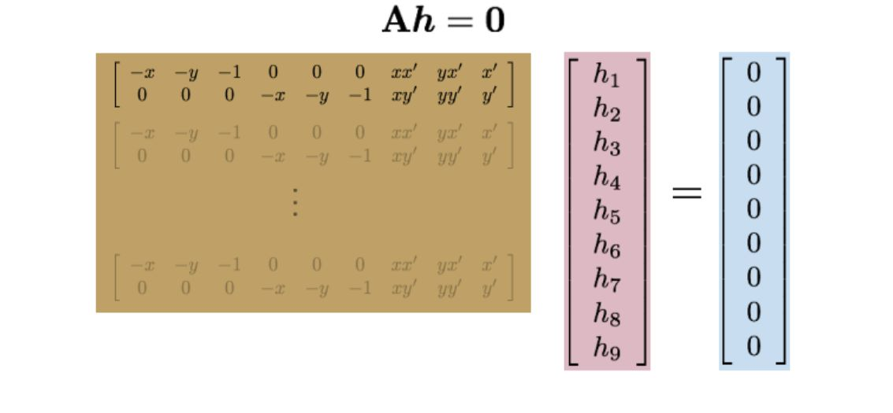

## 3 - Stitching Images
    In this step we are using the homography matrix to do the perspective
    transformation, for one of the images, and finally stitch the first
    image with the wrapped one.

#### 1- Multiply every pixel coordination in the (x', y') space with the homography matrix  to get the new coordination in the (x, y) space
#### 2- For every pixel in the (x', y') space that doesn't correspond to a single pixel in the (x, y) space, we will splat it's intensity with all the potential pixels, and finally averaging the intensities for every pixel in the (x, y) space
#### 3- Now for every black pixel in the transformed image, there are two possibilities:
  - It's original value is black
  - it has a fractional correspondence in the (x', y') space
 #### In both cases we will calculate the homography inverse matrix and get the (x', y') correspondence, and finally do a bilinear interpolation (weighted average) using the following formula:
 
 #### 4- Stitch the first image with the wrapped one

# Examples
## Example 1
### Inputs:
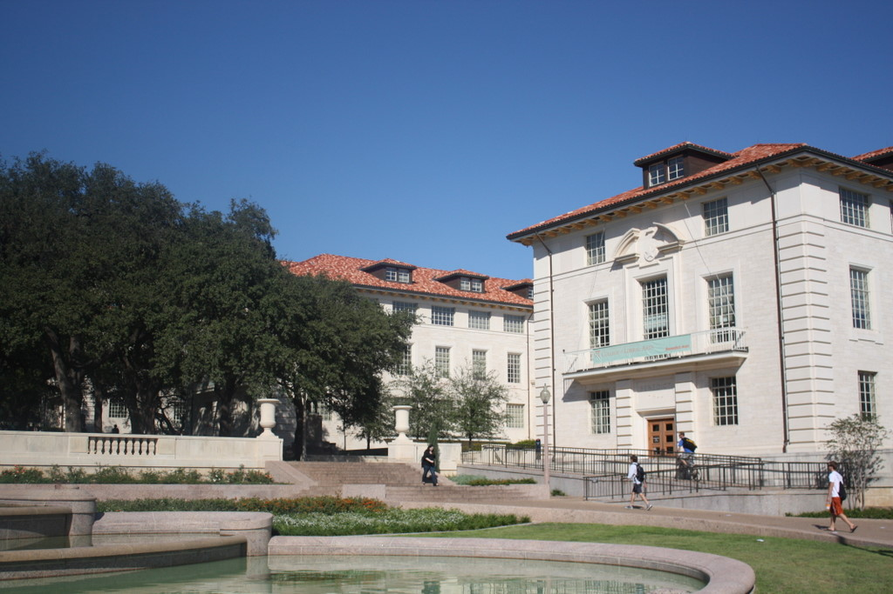
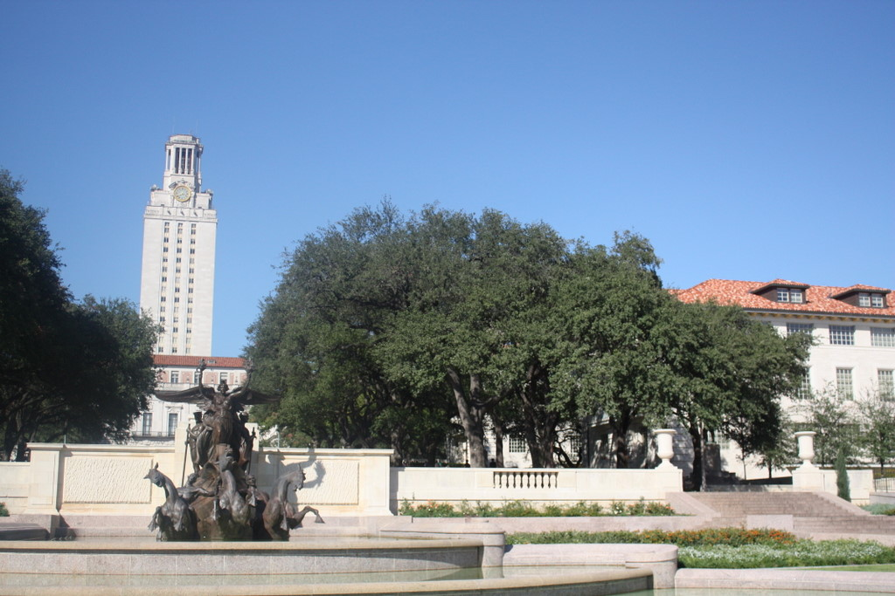
### Output:
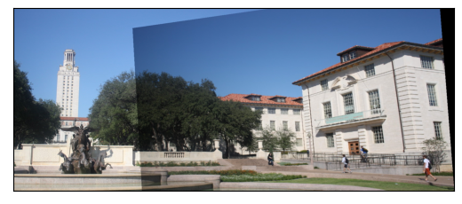
## Example 2
### Inputs:

### Output:
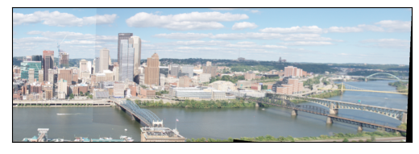
## Example 3
### Inputs:
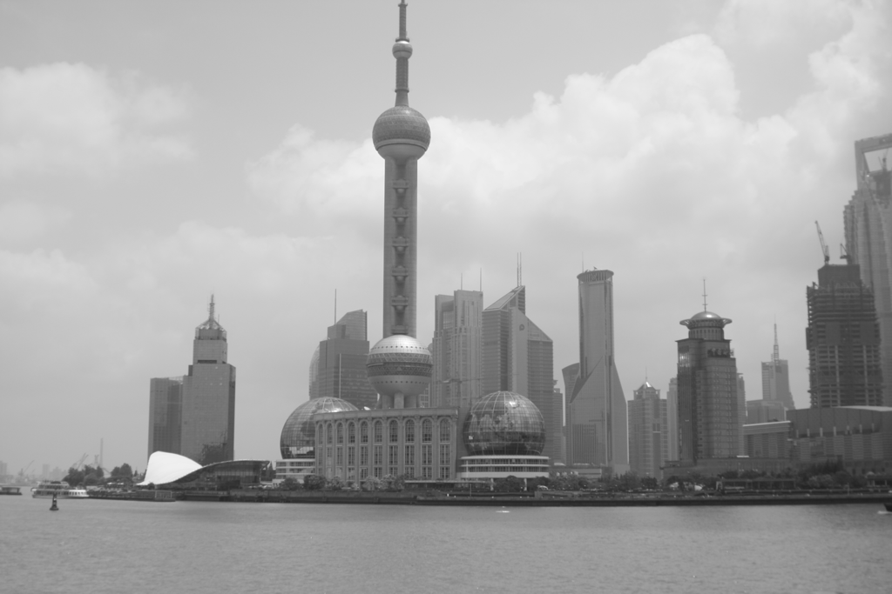
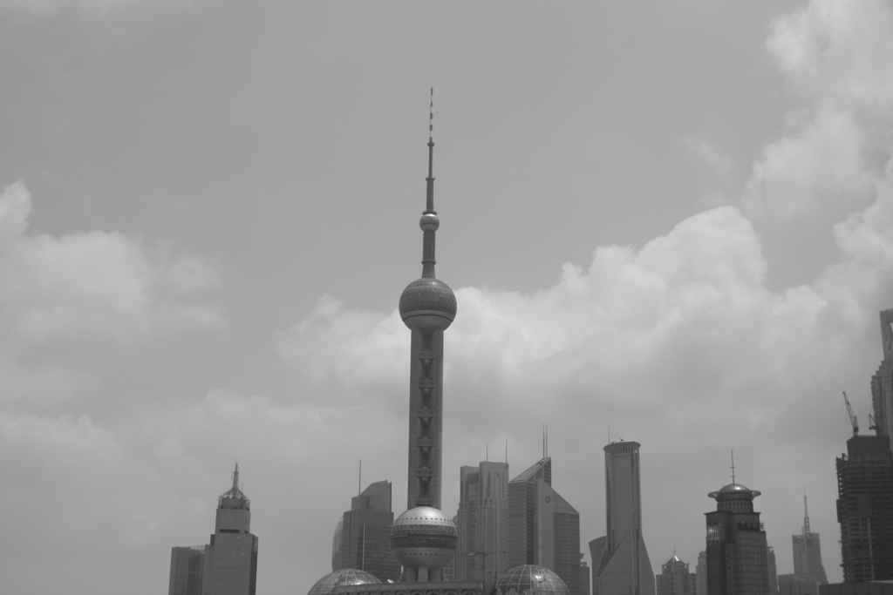
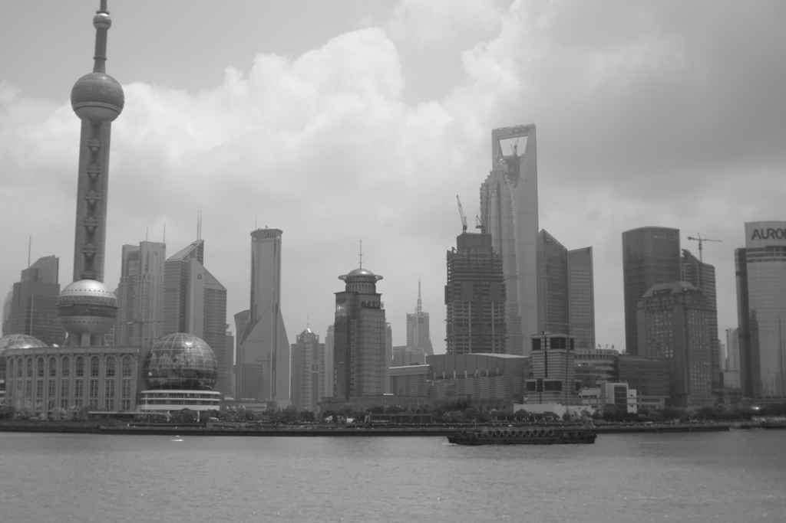
### Output:
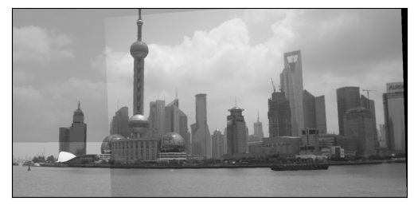